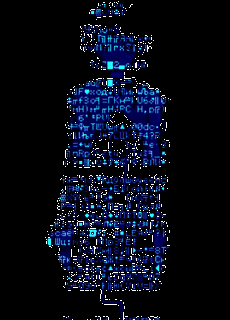

<table>
<tr>
<td width="240" align="center">

</td>
<td valign="middle">

# Clara Nogueira
### Engenharia Maker · Robótica · Automação · IoT

Graduanda em Engenharia de Controlo e Automação e entusiasta da cultura maker. Transformo ideias em protótipos funcionais usando eletrónica, programação e fabricação experimental.

**Meu foco:** criar, testar e documentar soluções que conectam hardware, software e criatividade.

</td>
</tr>
</table>

---

### Percepção & controlo
sensores, leitura de dados e controlo de atuadores

  

### Fabricação & firmware
do circuito ao código, protótipo por protótipo

  

### Sistemas
onde tudo isso roda e é versionado

  

---

### O que tem aqui

- Projetos de robótica, automação e sistemas embarcados
- Experimentos com sensores, comunicação e aquisição de dados
- Protótipos documentados do circuito ao código

### Atividade

    

